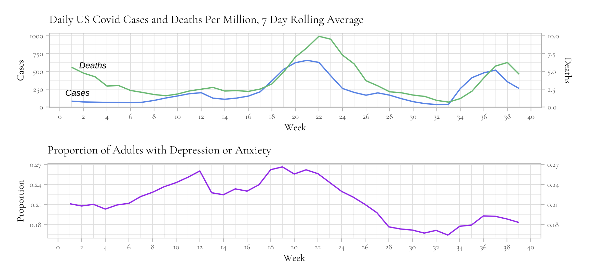
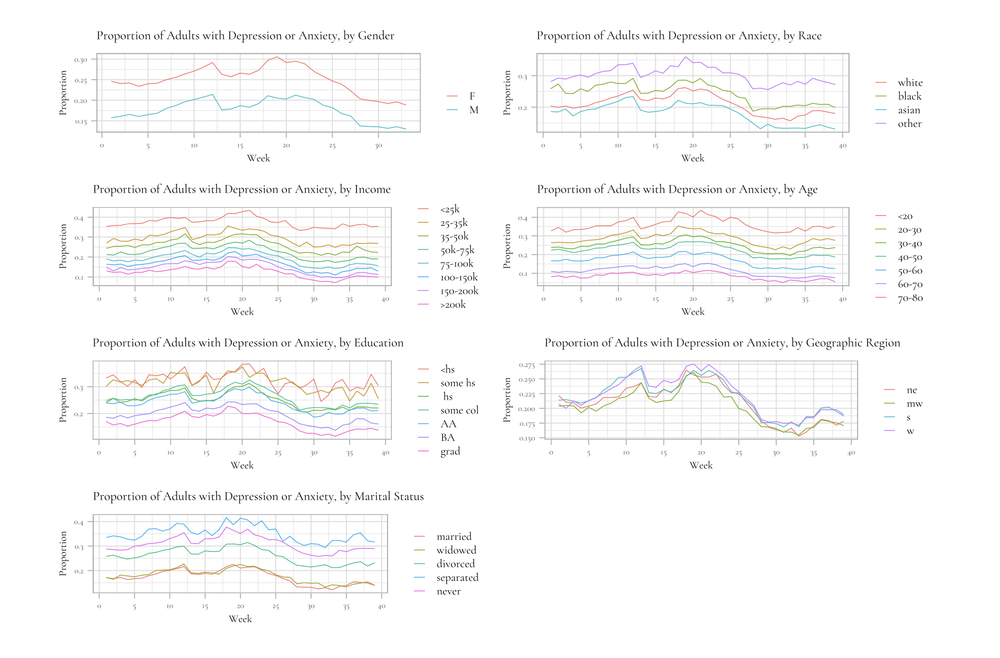

# COVID-mental-health: The link between the spread of COVID-19 and mental wellness in the United States
 
### Introduction
In this project I examine mental health trends in the United States during the COVID-19 pandemic, as well as the heterogeneity of these trends among subgroups including age, sex, and education level. 

I analyze data on the proportion of adults in the United States exhibiting symptoms of anxiety or depressive disorder. I expect to find a positive correlation between the likelihood of experiencing symptoms and the number of daily Covid cases and deaths. I also expect to find that minority groups report worse mental health on average.

**I find that on average, each additional increase of daily Covid deaths is associated with a 3.3% increase in the odds of experiencing depression or anxiety, and 0.1% for Covid cases. Reporting male, higher age, higher education, higher income, or hispanic is associated with much lower odds of experiencing anxiety and depression.**

### Data and Model
My dataset comprises of approximately 2,700,000 observations from following sources:
- Time series data from the CDC Household Pulse Survey</u>: records respondents' characteristics and symptoms of anxiety and depressive disorders from April 2020 to October 2021, recorded weekly
- Time series data from the *Our World in Data* database, which measures the spread of COVID-19 in the United States in terms of total and daily cases and deaths per capita throughout the pandemic
I use time series data from the CDC Household Pulse Survey, which records characteristics of respondents and their symptoms of anxiety and depressive disorders from April 2020 to October 2021 [@mhdata]. 

In my model, my outcome variable of interest is a dummy variable indicating 1 if the individual exhibits symptoms of depressive or anxiety disorder (*DEP_ANX*). My independent variables are the 7-day rolling average of daily cases and deaths per capita. I control for race, income level, education level, age, marital status, geographic region, and gender.

### Data Visualization of Covid cases and deaths
In the graph below, I compare the 7-day rolling average of daily Covid cases and deaths per million people with the proportion of adults with symptoms of depression or anxiety, by week (Week 0=23 April 2020). At first glance, there appears to be a positive correlation between daily cases, deaths, and symptoms. In other words, as Covid the number of cases and deaths increased, symptoms of depression and anxiety also increased. 

The graph below visualizes the heterogeneity of trends of the proportion of adults exhibiting depression or anxiety symptoms among subgroups. Individuals reporting higher education levels, higher yearly income, or higher age appear to have better mental health on average. Individuals that identify as Asian or White have the lowest proportions, as well as married and widowed individuals. Males have a significantly lower proportion than women. 

### Results
I estimate two logistic regressions with the likelihood of having symptoms of depression and anxiety as the dependent variable. The first regression model uses the 7-day rolling average of new daily Covid deaths as an independent variable, and the second uses the 7-day rolling average of new daily Covid cases as an independent variable. 

**I find that on average, each additional increase of daily Covid deaths is associated with a 3.3% (exp(0.033)-1) increase in the odds of experiencing depression or anxiety, and 0.1% for Covid cases.**

Regarding the heterogeneity of trends among subgroups, I observe the following:
* **Male respondents report better mental health than female respondents**. Reporting male is associated with a 26.1% reduction in odds of experiencing depression or anxiety compared to reporting female. 
* **Regarding marital status, separated respondents report the worst mental health trends.** Compared to married respondents, reporting "separated" is associated with the highest increase in odds of having depression or anxiety (55%), followed by "divorced" (29%), "never married" (23%), and "widowed" (16%).
* **Respondents with higher income and higher age have significantly better mental health.** Reporting a 200k+ yearly income is associated with a 70% reduction of odds of having depression or anxiety, and being over 70 years old with a 80% reduction.
* **Nonhispanic respondents report worse mental health than hispanic respondents.** Nonhispanic respondents are associated with a 17% reduction of odds of having depression or anxiety compared to hispanic respondents.
* **Asian respondents report the worst mental health, followed by White, and Black.** Compared to white respondents, reporting "asian" is associated with a 18% *increase* of odds of having depression or anxiety, "black" with a 18% *reduction* in odds, and "other" respondents with a 6% *reduction* in odds.
* **Those with higher education levels have significantly better mental health.** Reporting higher education is associated with a decrease in odds of having depression or anxiety. In particular, those having a college degree (AA, BA, graduate) are associated with a 17-20% decrease in odds compared to those without highschool education.
* Geographic regions do not have significantly different mental health levels.

### Discussion

Increased daily Covid deaths is associated with a 3.3% increase in odds of experiencing anxiety and depression. However, increased daily Covid cases is associated with a much smaller 0.1% increase. This may be because the effect of Covid cases is variable across local geographical regions: different regions experienced waves of cases at different times. By contrast, Covid deaths may have been more broadcasted across media, affecting the general public more jointly. Further analysis among smaller regions within the US may yield more accurate estimates of the association between Covid deaths or cases and mental health.

In addition, reporting male, higher age, higher education, higher income, or hispanic is associated with much lower odds of experiencing anxiety and depression, as expected. However, the data shows that black respondents are associated with the lowest odds of depression of anxiety, which disproves my hypothesis that minority racial groups are associated with higher odds of depression of anxiety. 

Given these findings, it is crucial for policy-makers to not only pursue policies that effectively fight the spread of Covid, but also bridge the mental health gap for minority groups. Indeed, this gap was likely a preexisting trend exacerbated by the pandemic. Policy-makers should consider encouraging lower education individuals to pursue higher education, for example by creating accessible, low-cost academic programs and scholarships. In addition, policy-makers should give minorities greater access to mental health services, for example by expanding telehealth programs and subsidizing costs of services.

Regarding global implications, a possible extension of this project is to examine temporal trends of mental health across different countries during the COVID-19 pandemic. By comparing two demographically similar countries that suffered Covid outbreaks at different times (for example, the United States and Canada), it may be possible to estimate the causal effect of the COVID-19 pandemic on mental health [@Alfano_2020]. For instance, while stay-at-home orders are effective in fighting the spread of Covid [@Friedson_2020], they may have adverse effects on the population's mental health [@Xu_2020]. These findings will push policy-makers to take mental health into consideration when designing policies in future global emergencies and economic downturns.
